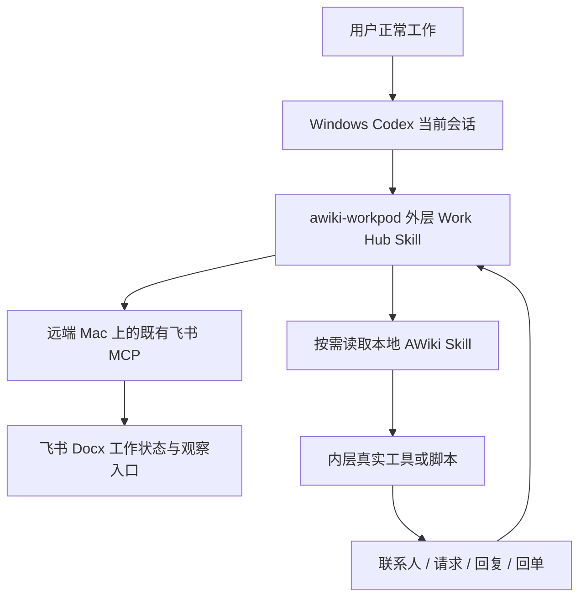

# Phase 1 执行方案

## 目标与范围

验证用户继续自然讨论时，Agent 能自动外化工作增量、识别跨会话语义 Thread、维护 Artifact metadata，基于 Goal 主动发现需要推进的成果，并通过现有 AWiki 通讯把外部反馈归回原工作。

选择 **instruction-only 外层 Skill + 既有 MCP/内层 Skill**。相比新增 Python/Node 编排后端，它更快验证行为价值、无需另建身份和状态服务；代价是依赖当前会话执行、无离线保障。仅复制长 Prompt 虽更快，但接口、恢复和可验收性不足。因此把稳定规则放 SKILL.md，数据/存储/通讯放 references。

## 架构与职责

Work Hub 是用户入口，WorkPod 是持续状态模型，`awiki-workpod` 是本次唯一新增的外层 Skill 名称，不额外制造多个同义 Skill。内部 AWiki 通讯 Skill 是用户已有依赖。外层也不包装成一个新的 MCP server。

| 层 | 责任 | 不承担 |
|---|---|---|
| Codex | 读取 Skill、理解当前输入、调用真实能力 | 离线监听所有会话 |
| 外层 Skill | Matter/Thread/Span、Work Surface、状态归属、Suggestion、Observatory | 通讯协议重写 |
| mac 飞书 MCP | allowlist 内页面读取、创建、guarded append、receipt | 任意 Mac 文件访问 |
| 本地 AWiki Skill | 已有联系人/通讯能力 | 自动管理 Work Graph |
| 飞书 Docx | 持续事实、快照、I/O、页面索引 | 事务数据库/分布式锁 |

## 跨主机边界

Codex、外层 Work Hub Skill、内层 AWiki Skill 和 AWiki CLI 在当前 Windows 本地运行。mac 飞书 MCP 的服务端在 Mac，由当前 Codex 已连接的工具通道调用。无需迁移 Codex 到 Mac，也无需在 Windows 复制飞书服务或 Mac 凭据。当前跨主机 read_page 已成功；后续通过同一通道执行受保护的写入。

## 数据、存储与循环

完整对象字段见 [数据契约](../skills/awiki-workpod/references/data_contract.md)，七个页面及真实 MCP 调用见 [存储约定](../skills/awiki-workpod/references/feishu_store.md)。只登记 Artifact metadata；用户给的不可访问成果可登记 unavailable，不读取/扫描本地成果文件。

循环：BOOTSTRAP → OBSERVE CONVERSATION → RESOLVE → PROJECT → ACT → EXTERNALIZE → OBSERVE WORK STATE → SUGGEST。每个有意义的回合执行；闲聊无增量则不写。用户指正归线时更新 Span 并记录纠错，Agent 维护结构，用户不充当资料管理员。

轻量 RESOLVE 采用显式用户意图、现有标题/摘要及少量候选判断；不是独立 Router，不用向量库或跨 Pod 路由。Thread 只有出现独立目标与验收边界时才建议升级 Matter。

Work Surface 从当前 Intent 出发，只含相关 Thread、已接受决策、对应版本成果、未解决问题及可用能力。大文档仅登记逻辑模块；合成建议引用指定模块版本，不自动切分文件。

## Work Observability 与主动建议

Dashboard 单入口展示当前 Matter/Goal/Thread、近期事件、受影响 Artifact、真实阻塞、等待回复和建议。Thread Timeline 展示工作事件，I/O Monitor 展示动作的工作目的和实际结果。每个状态有 source/event/receipt，不做虚构百分比。

Suggestion 五类触发：明确上游变化影响已登记依赖；多个增量改变同一 Goal；问题/回复/资源解除阻塞；需找人或资源；多个已接受模块达到可组合条件。可读输出是“因为 E1/E2 改变 D7，V13 依赖旧版本，建议 Review 对应主题”。未读 PPT 不给虚构页码。

规则默认每回合最多 1 条、同因 24 小时内不重复；accepted 尚未完成不反复提；dismissed 除新证据/用户重开不再出现。done 必须有动作结果；用户接受建议不自动证明已完成。

## 执行分解

1. **M0 能力盘点**：确认 Windows host、Codex 可见 MCP、allowlist、内部 Skill 的绝对路径和真实工具。填 capability inventory；不提交凭据。
2. **M1 加载**：仓库 skills 源目录链接到 `.agents/skills`，内层保持原安装；新会话显式调用外层，确认按需能读内层。
3. **M2 建库**：通过已有 MCP 在允许根内复用/创建专用 P0 容器及七页，回填 refs；稳定 operation ID；回读验证，Dashboard 放索引。
4. **M3 工作闭环**：Golden Matter，A1/B1/A2 与新会话 B2，用户纠错、Decision、Artifact V13 metadata、上游改变、主动建议和观察入口。
5. **M4 通讯闭环**：外层 draft → 授权 → 内层真实发送 → receipt → 活跃会话查询回复 → 原 WR/Thread → 问题/成果影响。通讯契约见 [adapter](../skills/awiki-workpod/references/communication_adapter.md)。
6. **M5 dogfood**：至少 30 个真实工作回合、3 个 Session，冷启动接手；填写实际测试记录和指标，补齐缺口再验收。

步骤及可复制命令见 [Codex 接手指南](codex_handoff.md)。交付物是可用 Skill、真实连接配置（留本机）、飞书入口与真实测试证据，不要求应用后端。

## 成功指标

| 指标 | 采集方法与门槛 |
|---|---|
| 高置信度归线 | 用户复核至少 10 个自动归线 Span，正确数/总数 ≥80%；全量保留分母 |
| 结构维护负担 | ≥30 回合中用户仅为结构维护而纠正的次数/总回合 ×10 <1 |
| Artifact 连续性 | 100% tracked Artifact 有 observed/accepted（可 null）和 retrieval_status，证据明确 |
| 回单准确性 | unknown/timeout 被误报成功次数 =0；写入/发送各有可追溯证据 |
| Suggestion 有用性 | 用户判定有用或实际执行/全部提出建议 >50%；至少 4 条独立建议，否则样本不足 |
| 去重 | 同因重复建议 0；无关闲聊不制造工作垃圾 |
| 协作连续性 | 至少一次真实授权收发；全部已观察到回复回到原 WR/Thread或明确暂挂，错误归线 0 |
| 可观察性 | 用户由一个入口回答“做什么/变了什么/需要我什么”，每项有证据 |
| 冷启动接手 | 新会话仅提供 Dashboard 入口，恢复 B 的 Goal、决策、成果版本、问题和下一步 |

完整 Phase 1 需测试核心场景和实际通讯通过；样本不足或内层缺失应报告部分通过，不调低门槛。

## 非目标和已知限制

不做本地文件 daemon、扫描/同步/监控、Host Sandbox、复杂 Router、ANP federation、A2A 协议实现、通用图数据库、独立前端、Bitable 迁移、自动全会话采集、常驻收件轮询。现有 AWiki 内部如何通讯不在本项目重写范围。

无离线主动唤醒；无多页原子事务；单写者约定不能解决全部竞态；Skill 行为仍需 dogfood 检验。未写入飞书的增量可能随会话中断丢失，不通过新增本地状态服务掩盖限制。
